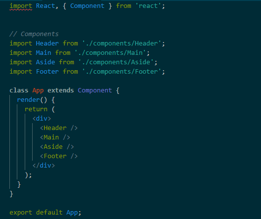
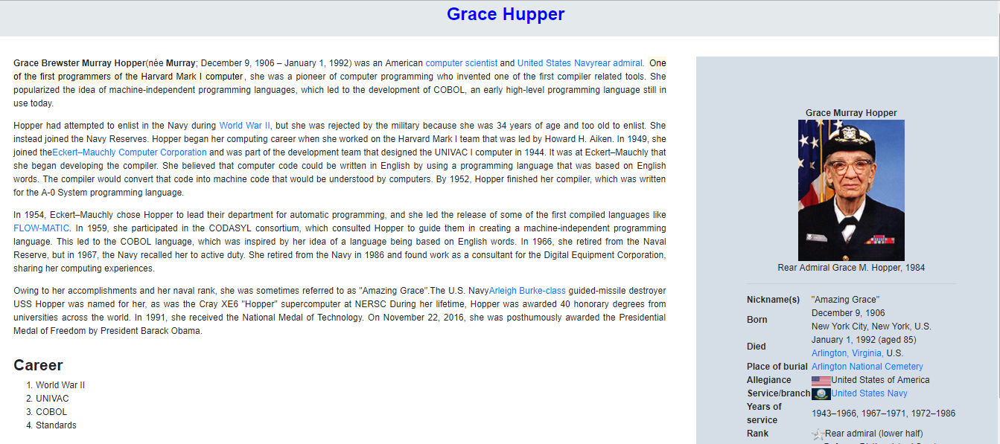

# Grace Hupper

## Descripción
Realizar con react la página de Grace Huper,nacida en Nueva York (EE. UU.). científica de la computación y primera programadora que desarrolló el primer compilador para un lenguaje de programación .

## Componentes
La composiciópn la tenemos en App, son cuatro componentes header, main, aside y footer con sus respectivos estilos.

##  Recursos utilizados

* HTML5
* CSS
* JQUERY
* Eslintrc 
* Bootstrap
* React

## Autor

* Jymma Mogollon

## Producto

## Licencia

*Copyright (C) 2018 ~ *
